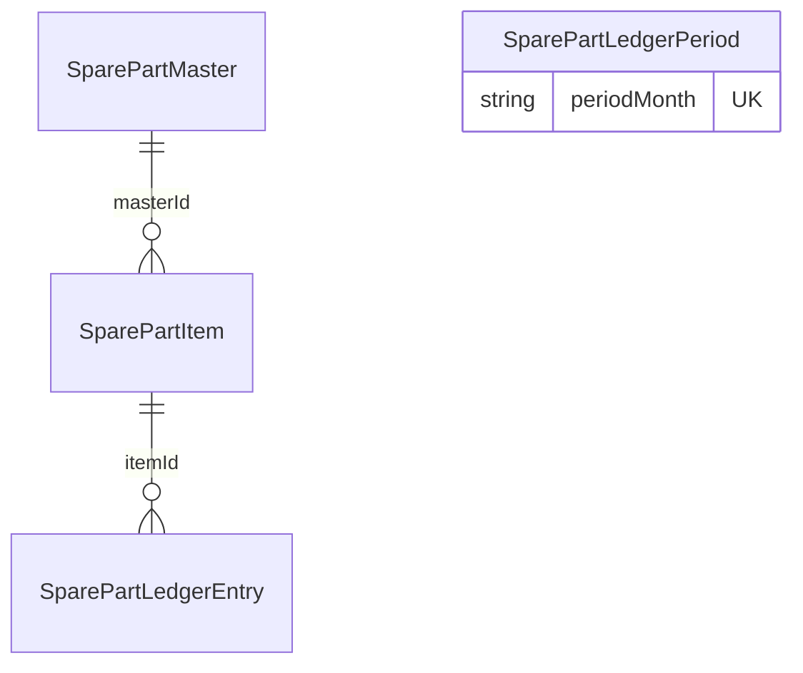

# 사출기 부품 기초정보 테이블 명세서

| 항목 | 내용 |
|------|------|
| 문서 버전 | 1.0 |
| 작성일 | 2026-05-18 |
| 시스템 | SAMKWANG-PROS (생산관리시스템) |
| DBMS | PostgreSQL 16 |
| ORM | Prisma 6 |

---

## 1. 개요

### 1.1 목적

사출기 예비부품의 **기초정보(마스터)** 를 기준정보 메뉴에서 등록·관리하고, 생산관리의 **입출고·재고** 기능과 분리하여 데이터 정합성을 확보한다.

### 1.2 범위

| 구분 | 포함 | 비고 |
|------|------|------|
| 신규 | `SparePartMaster` 테이블 정의 | 본 명세의 핵심 |
| 변경(예정) | `SparePartItem.masterId` FK 추가 | 2단계 구현 |
| 유지 | `SparePartLedgerEntry`, `SparePartLedgerPeriod` | 구조 변경 없음 |

### 1.3 용어

| 용어 | 설명 |
|------|------|
| 기초정보 / 마스터 | 부품의 고정 속성(코드, 명칭, 규격, 적정재고 등). 수량 변동 없음 |
| 입출고 행 (`SparePartItem`) | 관리대장上的 1행. 현재재고·월별 입출고 집계의 단위 |
| 입출고 이력 | `SparePartLedgerEntry` — 입고·출고 트랜잭션 |

### 1.4 설계 방침 (단일 마스터 테이블)

- **단일형**: 사출기·부품 속성을 `SparePartMaster` 한 테이블에 저장한다.
- **재고 분리**: 실시간 재고(`currentQty`)와 입출고 이력은 기존 `SparePartItem` / `SparePartLedgerEntry`에만 둔다.
- **하위 호환**: 기존 자유 입력으로 생성된 `SparePartItem`은 `masterId = NULL`로 유지하며 점진 이관한다.

---

## 2. ER 개요



| 관계 | 카디널리티 | 설명 |
|------|------------|------|
| `SparePartMaster` → `SparePartItem` | 1 : N | 한 마스터에서 여러 입출고 행 생성 가능(라인·기간 분리 시) |
| `SparePartItem` → `SparePartLedgerEntry` | 1 : N | 행별 입·출고 이력 |
| `SparePartLedgerPeriod` | 독립 | 월(YYYY-MM) 단위 결재 메타 |

---

## 3. 테이블 목록

| # | 물리명 | 한글명 | 신규/기존 | 용도 |
|---|--------|--------|-----------|------|
| 1 | `SparePartMaster` | 사출기 예비부품 기초정보 | **신규** | 기준정보 CRUD |
| 2 | `SparePartItem` | 사출기 예비부품 입출고 행 | 기존 | 관리대장 행·현재재고 |
| 3 | `SparePartLedgerEntry` | 예비부품 입출고 이력 | 기존 | 입고/출고 트랜잭션 |
| 4 | `SparePartLedgerPeriod` | 월별 관리대장 결재 | 기존 | 결재(작성/검토/확인/팀장) |

---

## 4. 테이블 상세

### 4.1 `SparePartMaster` (신규)

**한글명:** 사출기 예비부품 기초정보  
**설명:** 기준정보 > 사출기 부품 등록·조회·수정. 입출고 수량은 저장하지 않는다.

#### 컬럼 정의

| # | 컬럼명 | 한글명 | PostgreSQL 타입 | NULL | 기본값 | 제약·설명 |
|---|--------|--------|-----------------|------|--------|-----------|
| 1 | `id` | ID | `TEXT` | N | (cuid) | PK |
| 2 | `partCode` | 부품코드 | `VARCHAR(50)` | N | — | **UNIQUE**, 사내 고유 식별자 ([§4.1.1](#411-부품코드-partcode-규칙)) |
| 3 | `machineBrand` | 사출기 | `VARCHAR(100)` | N | — | 브랜드·톤수·호기 표기. 예: `LS 850T #3` |
| 4 | `productName` | 제품명(부품명) | `VARCHAR(200)` | N | — | |
| 5 | `spec` | 규격 | `VARCHAR(200)` | Y | `NULL` | |
| 6 | `unit` | 단위 | `VARCHAR(20)` | N | `'EA'` | EA, SET, KG 등 |
| 7 | `optimalQty` | 적정재고 | `NUMERIC(14,4)` | N | `0` | CHECK `optimalQty >= 0` |
| 8 | `manufacturer` | 제조사/공급처 | `VARCHAR(100)` | Y | `NULL` | |
| 9 | `storageLocation` | 보관위치 | `VARCHAR(100)` | Y | `NULL` | 창고·랙·선반 등 |
| 10 | `leadTimeDays` | 조달리드타임(일) | `INTEGER` | Y | `NULL` | CHECK `leadTimeDays IS NULL OR leadTimeDays >= 0` |
| 11 | `remarks` | 비고 | `TEXT` | Y | `NULL` | |
| 12 | `isActive` | 사용여부 | `BOOLEAN` | N | `true` | `false` = 소프트 비활성 |
| 13 | `sortOrder` | 정렬순서 | `INTEGER` | N | `0` | 목록 오름차순 |
| 14 | `createdBy` | 등록자 | `VARCHAR(100)` | Y | `NULL` | `User.username` 스냅샷 |
| 15 | `updatedBy` | 수정자 | `VARCHAR(100)` | Y | `NULL` | |
| 16 | `createdAt` | 등록일시 | `TIMESTAMPTZ(3)` | N | `now()` | |
| 17 | `updatedAt` | 수정일시 | `TIMESTAMPTZ(3)` | N | `now()` | 갱신 시 자동 변경 |

#### 4.1.1 부품코드 (`partCode`) 규칙

| 규칙 | 내용 |
|------|------|
| 형식 | `SP-{그룹}-{일련번호}` (권장) |
| 예시 | `SP-LS-001`, `SP-LS-002`, `SP-HD-001` |
| `SP` | Spare Part 고정 접두사 |
| `{그룹}` | 사출기/라인 약어 2~6자 (대문자·숫자). 예: `LS`, `HD850` |
| `{일련번호}` | 3자리 이상 숫자 (zero-padding 권장) |
| 문자 집합 | 영문 대문자, 숫자, 하이픈(`-`)만 허용 |
| 최대 길이 | 50자 |
| 중복 | 시스템 전역 UNIQUE |
| 자동 채번 | 2단계 구현 시 API에서 `SP-{machinePrefix}-{nextSeq}` 생성 가능 (선택) |

수동 입력 시에도 위 형식을 권장하며, 레거시 코드는 마이그레이션 시 일괄 매핑한다.

#### 인덱스

| 이름 | 유형 | 컬럼 | 용도 |
|------|------|------|------|
| `SparePartMaster_pkey` | PRIMARY | `id` | |
| `SparePartMaster_partCode_key` | UNIQUE | `partCode` | 부품코드 유일 |
| `SparePartMaster_machineBrand_productName_idx` | INDEX | `machineBrand`, `productName` | 목록·검색 |
| `SparePartMaster_isActive_sortOrder_idx` | INDEX | `isActive`, `sortOrder` | 활성 목록 정렬 |

#### Prisma 모델 (참고)

```prisma
model SparePartMaster {
  id              String   @id @default(cuid())
  partCode        String   @unique @db.VarChar(50)
  machineBrand    String   @db.VarChar(100)
  productName     String   @db.VarChar(200)
  spec            String?  @db.VarChar(200)
  unit            String   @default("EA") @db.VarChar(20)
  optimalQty      Decimal  @default(0) @db.Decimal(14, 4)
  manufacturer    String?  @db.VarChar(100)
  storageLocation String?  @db.VarChar(100)
  leadTimeDays    Int?
  remarks         String?
  isActive        Boolean  @default(true)
  sortOrder       Int      @default(0)
  createdBy       String?  @db.VarChar(100)
  updatedBy       String?  @db.VarChar(100)
  createdAt       DateTime @default(now())
  updatedAt       DateTime @updatedAt

  items SparePartItem[]

  @@index([machineBrand, productName])
  @@index([isActive, sortOrder])
}
```

#### 업무 규칙

1. `partCode`는 등록 후 변경하지 않는 것을 원칙으로 한다 (변경 시 이력·연계 영향 검토).
2. `optimalQty`는 기초정보상 권장 재고이며, 실제 재고는 `SparePartItem.currentQty`가 기준이다.
3. `isActive = false`인 마스터는 신규 `SparePartItem` 생성 시 선택 목록에서 제외한다.
4. 삭제는 물리 삭제 대신 `isActive = false` 소프트 비활성을 사용한다.
5. 이미 `SparePartItem`에 연결된 마스터는 비활성화만 허용하고, 물리 삭제는 금지한다.

---

### 4.2 `SparePartItem` (기존 + 변경 예정)

**한글명:** 사출기 예비부품 입출고 행  
**설명:** 설비 부품 입출고 관리현황 화면의 1행. 월별 입·출고 합계·현재재고의 기준 엔티티.

#### 현재 컬럼 (운영 중)

| # | 컬럼명 | 한글명 | 타입 | NULL | 기본값 | 설명 |
|---|--------|--------|------|------|--------|------|
| 1 | `id` | ID | TEXT | N | cuid | PK |
| 2 | `machineBrand` | 사출기 | TEXT | N | — | 화면 표시용 |
| 3 | `productName` | 제품명 | TEXT | N | — | |
| 4 | `spec` | 규격 | TEXT | Y | NULL | |
| 5 | `optimalQty` | 적정재고 | NUMERIC(14,4) | N | 0 | 마스터와 동기 권장 |
| 6 | `currentQty` | 현재재고 | NUMERIC(14,4) | N | 0 | 입출고 누적 결과 |
| 7 | `remarks` | 비고 | TEXT | Y | NULL | |
| 8 | `createdAt` | 등록일시 | TIMESTAMPTZ | N | now() | |
| 9 | `updatedAt` | 수정일시 | TIMESTAMPTZ | N | now() | |

#### 변경 예정 컬럼 (2단계)

| # | 컬럼명 | 한글명 | 타입 | NULL | 설명 |
|---|--------|--------|------|------|------|
| 10 | `masterId` | 마스터 ID | TEXT | Y | FK → `SparePartMaster.id`, `ON DELETE SET NULL` |

#### 연계 규칙

| 시나리오 | 동작 |
|----------|------|
| 마스터에서 행 추가 | `SparePartMaster` 선택 → `SparePartItem` 생성 (`masterId` 설정, `currentQty = 0`, 텍스트 필드는 마스터 값 복사) |
| 레거시 행 | `masterId = NULL`, 기존처럼 화면에서 직접 수정 가능 |
| 마스터 수정 | `optimalQty` 등 변경 시 연결된 `SparePartItem` 스냅샷 필드 동기 여부는 구현 시 정책 선택 (권장: 신규 행만 마스터 참조, 기존 행은 스냅샷 유지) |

#### 인덱스 (현재)

- `@@index([machineBrand, productName])`
- (예정) `@@index([masterId])`

---

### 4.3 `SparePartLedgerEntry` (기존 — 변경 없음)

**한글명:** 예비부품 입출고 이력

| # | 컬럼명 | 한글명 | 타입 | NULL | 설명 |
|---|--------|--------|------|------|------|
| 1 | `id` | ID | TEXT | N | PK |
| 2 | `itemId` | 입출고 행 ID | TEXT | N | FK → `SparePartItem.id` CASCADE |
| 3 | `type` | 구분 | ENUM | N | `INBOUND` \| `OUTBOUND` |
| 4 | `qty` | 수량 | NUMERIC(14,4) | N | > 0 |
| 5 | `occurredAt` | 발생일시 | TIMESTAMPTZ | N | |
| 6 | `note` | 비고 | TEXT | Y | |
| 7 | `createdAt` | 등록일시 | TIMESTAMPTZ | N | |

---

### 4.4 `SparePartLedgerPeriod` (기존 — 변경 없음)

**한글명:** 월별 관리대장 결재 기록

| # | 컬럼명 | 한글명 | 타입 | NULL | 설명 |
|---|--------|--------|------|------|------|
| 1 | `id` | ID | TEXT | N | PK |
| 2 | `periodMonth` | 기준월 | TEXT | N | UNIQUE, `YYYY-MM` |
| 3 | `preparedBy` | 작성자 | TEXT | Y | |
| 4 | `preparedAt` | 작성일시 | TIMESTAMPTZ | Y | |
| 5 | `reviewedBy` | 검토자 | TEXT | Y | |
| 6 | `reviewedAt` | 검토일시 | TIMESTAMPTZ | Y | |
| 7 | `confirmedBy` | 확인자 | TEXT | Y | |
| 8 | `confirmedAt` | 확인일시 | TIMESTAMPTZ | Y | |
| 9 | `teamLeadBy` | 팀장 | TEXT | Y | |
| 10 | `teamLeadAt` | 팀장일시 | TIMESTAMPTZ | Y | |
| 11 | `createdAt` | 등록일시 | TIMESTAMPTZ | N | |
| 12 | `updatedAt` | 수정일시 | TIMESTAMPTZ | N | |

---

## 5. 화면·API 매핑 (구현 예정)

### 5.1 메뉴

| 위치 | 라벨 | 경로 |
|------|------|------|
| 상단 | 기준정보 | `/app/master-data` |
| 사이드 (예정) | 사출기 부품 기초정보 | `/app/master-data/spare-parts` |

### 5.2 API (NestJS, 예정)

| 메서드 | 경로 | 설명 | 테이블 |
|--------|------|------|--------|
| GET | `/api/master-data/spare-parts` | 목록·검색 (`machineBrand`, `partCode`, `isActive`) | `SparePartMaster` |
| GET | `/api/master-data/spare-parts/:id` | 단건 조회 | `SparePartMaster` |
| POST | `/api/master-data/spare-parts` | 등록 | `SparePartMaster` |
| PATCH | `/api/master-data/spare-parts/:id` | 수정 | `SparePartMaster` |
| PATCH | `/api/master-data/spare-parts/:id/deactivate` | 비활성 (`isActive=false`) | `SparePartMaster` |

생산관리 입출고 API (`/api/spare-parts/*`)는 기존 유지. 행 추가 시 `masterId` 연동은 2단계에서 반영한다.

### 5.3 화면 필드 매핑 (`SparePartMaster`)

| UI 라벨 | 컬럼 | 필수 |
|---------|------|------|
| 부품코드 | `partCode` | Y |
| 사출기 | `machineBrand` | Y |
| 제품명 | `productName` | Y |
| 규격 | `spec` | N |
| 단위 | `unit` | Y (기본 EA) |
| 적정재고 | `optimalQty` | Y |
| 제조사/공급처 | `manufacturer` | N |
| 보관위치 | `storageLocation` | N |
| 조달리드타임(일) | `leadTimeDays` | N |
| 비고 | `remarks` | N |
| 사용여부 | `isActive` | Y |

---

## 6. 샘플 데이터

### 6.1 `SparePartMaster`

| partCode | machineBrand | productName | spec | unit | optimalQty | manufacturer | storageLocation | leadTimeDays | isActive |
|----------|--------------|-------------|------|------|------------|--------------|-----------------|--------------|----------|
| SP-LS-001 | LS 850T #1 | 히터밴드 | φ50×200 | EA | 2.0000 | — | A-01-03 | 7 | true |
| SP-LS-002 | LS 850T #1 | 노즐 | M6 | EA | 5.0000 | — | A-01-04 | 3 | true |
| SP-HD-001 | Hyundai 1000T | 유압호스 | 1/2" | EA | 1.0000 | (주)OO유압 | B-02-01 | 14 | true |

### 6.2 연계 후 `SparePartItem` (예시)

| id | masterId | machineBrand | productName | currentQty |
|----|----------|--------------|-------------|------------|
| (cuid) | (SP-LS-001의 id) | LS 850T #1 | 히터밴드 | 1.0000 |

---

## 7. 마이그레이션 방향

| 단계 | 작업 |
|------|------|
| 1 | `SparePartMaster` 테이블 생성 (본 명세) |
| 2 | `SparePartItem.masterId` nullable FK 추가 |
| 3 | 기존 `SparePartItem` distinct 조합으로 마스터 자동 생성 스크립트 (선택) |
| 4 | 기준정보 CRUD 화면·API 배포 |
| 5 | 입출고 화면에서 마스터 선택 기반 행 추가 |

---

## 8. 변경 이력

| 버전 | 일자 | 변경 내용 |
|------|------|-----------|
| 1.0 | 2026-05-18 | 최초 작성 (단일 마스터 테이블, `SparePartItem` 연계, 부품코드 규칙 확정) |
